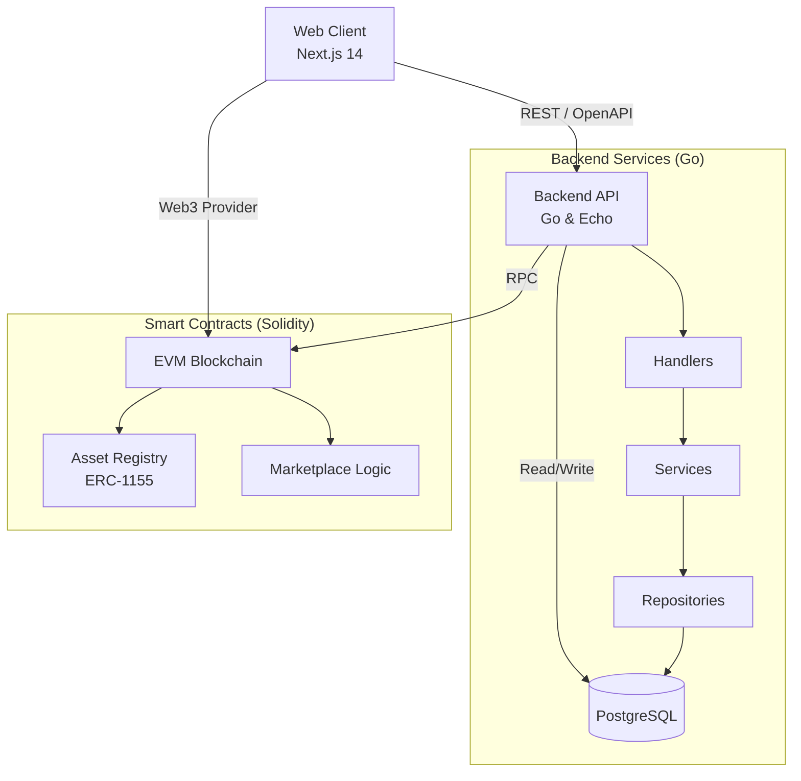

# Ledgera - System Architecture

Ledgera is a full-stack, blockchain-enabled Real-World Asset (RWA) Marketplace specializing in the tokenization and trading of Carbon Credits. This document outlines the system architecture, design patterns, and technical decisions that power the platform.

---

## 🏗 High-Level System Architecture

Ledgera operates on a modern, distributed architecture combining a high-performance Web2 backend with a Web3 decentralized settlement layer. 

---

## 🛠 Technology Stack

### Frontend (Client Layer)
- **Framework**: Next.js 16 (App Router)
- **Styling**: Tailwind CSS & Shadcn UI
- **State Management**: React Query (Server State), Local Context
- **Authentication**: Clerk (Web2) + Wallet Integration (Web3)

### Backend (API Layer)
- **Language**: Go (Golang)
- **Framework**: Echo v4
- **Database**: PostgreSQL (via `pgx` native driver)
- **Validation**: `go-playground/validator`
- **Architecture Pattern**: Strict 3-Layer (Clean Architecture)

### Smart Contracts (Blockchain Layer)
- **Language**: Solidity
- **Framework**: Foundry (Forge/Cast)
- **Standards**: ERC-1155 (Multi-Token Standard), OpenZeppelin
- **Network**: EVM-Compatible (Ethereum/Polygon/L2s)

### Tooling & Infrastructure
- **Monorepo Management**: pnpm workspaces + Turborepo
- **API Contracts**: OpenAPI (Swagger) Code Generation
- **Shared Packages**: Zod (Validation), Custom Email templates

---

## 🧩 Architectural Deep Dive

### 1. Backend: Strict 3-Layer Architecture
The Go backend strictly adheres to a domain-driven, 3-layer architecture to ensure decoupling, testability, and scalability.

1. **Handler Layer (`internal/handler`)**: 
   - Responsible for HTTP request parsing, JSON unmarshaling, and validating DTOs.
   - Converts HTTP context dependencies and calls the Service layer.
   - *Constraint*: Strictly prohibited from interacting with the database.
2. **Service Layer (`internal/service`)**: 
   - Contains all core business logic and state transitions.
   - Orchestrates calls between Repositories, external APIs, and Blockchain RPC clients.
3. **Repository Layer (`internal/repository`)**: 
   - Executes raw SQL queries using `pgx` with parameterized execution to prevent SQL injection.
   - Maps database rows directly into rich Domain Models. No ORM is utilized to ensure maximum query performance and control.

### 2. Frontend: Modular App Router
The web application leverages Next.js 14's Server React DOM.
- **Data Fetching**: Extensively uses Server Components for initial load, falling back to React Query via customized `axios` instances for dynamic client-side interactions.
- **Component Design**: Driven by Shadcn UI for accessible, unstyled, customizable components mapped directly into Tailwind tokens.

### 3. Smart Contracts: ERC-1155 Asynchronous Settlement
Ledgera utilizes an advanced ERC-1155 multi-token implementation for tokenizing RWA Carbon Credits.
- **AssetRegistry**: Mints and tracks fractionalized carbon credit assets. It manages the token lifecycle, including retirement/burning.
- **Marketplace**: Non-custodial escrow contracts that securely facilitate peer-to-peer (P2P) trading of carbon assets.

---

## 🚀 Current Progress & Implementation Status

- [x] **Monorepo Scaffolding**: Configured Turborepo, shared tasks (`Taskfile.yml`), and workspace packages (`@ledgera/openapi`, `@ledgera/zod`).
- [x] **Smart Contracts V1**: Implemented `AssetRegistry` and `AssetToken`, currently refactoring to standard ERC-1155 to support semi-fungible fraction pools (`feat/erc-1155-refactor`).
- [x] **Go Backend Foundation**: 
  - Boilerplate established with Echo v4.
  - Setup graceful shutdown, environment config, and robust SQL error-handling middleware.
  - Initial 3-Layer implementation for core entities.
- [x] **Web Application**: Basic dashboard shell implemented with Next.js, integrating Clerk Auth and Shadcn dashboard layouts.

---

## 🔮 Future Aspects & Technical Roadmap

As the Ledgera marketplace scales, the architecture is designed to evolve into a more asynchronous, decentralized, and high-throughput system.

1. **On-Chain Event Indexing**
   - **Plan**: Implement a custom Go-based indexer (or integrate an EVM indexer like Envio/TheGraph) configured to listen to `TransferSingle`, `OrderMatched`, and `AssetTokenized` logs.
   - **Impact**: Syncs blockchain state reliably with the internal PostgreSQL cache, ensuring the frontend queries web2 speeds while preserving web3 single-source-of-truth.
   
2. **Decentralized Storage (IPFS/Arweave)**
   - **Plan**: Migrate RWA metadata (certifications, audits, KYC of providers) from centralized S3 buckets to decentralized storage to achieve immutable audit trails.

3. **Layer 2 (L2) Rollup Settlement**
   - **Plan**: Deploy logic to Arbitrum or Base. Carbon credits involve micro-transactions; settling on L2 will reduce gas fees by 99% while inheriting Ethereum mainnet security.

4. **Zero-Knowledge (ZK) Compliance**
   - **Plan**: Add ZK-proofs for institutional KYC. Buyers could prove they are accredited entities without revealing exact corporate identities on the public ledger.

5. **Advanced Market Making**
   - **Plan**: Implement on-chain Automated Market Maker (AMM) liquidity pools specific to ERC-1155 carbon assets, stepping away from strictly P2P order books.